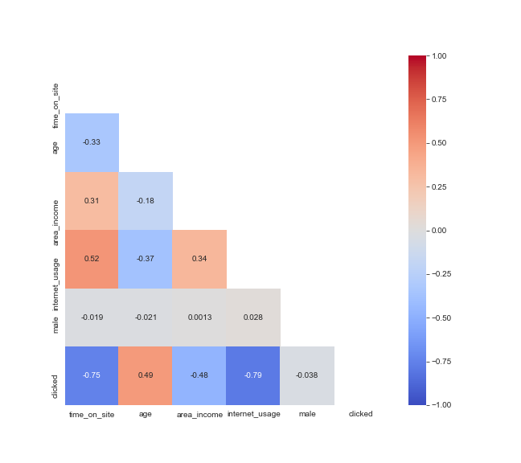

# Problem 
Company A would like to create awareness about product M and is interested in working with Media conglomerate company X. X has multiple websites within its network but only 10 have the right audience and provide the relevant contextual environment for company A.
The goal is to increase awareness of product M and therefore accuracy in correctly predicting whether a consumer will click on the ad is key. 

# Task
Create a model saved in a pickle with an accuracy above the baseline of 95%.

# Data set characteristics
Daily Time Spent on Site: The time spent on the site in minutes

Age: Customer age in years

Area Income: Avg. Income of geographical area of consumer

Daily Internet Usage: Avg. time in minutes a day consumer is on the internet

Ad Topic Line: Headline of the advertisement

City: City of consumer

Male: Whether the consumer was male or not

Country: Country of consumer

Timestamp: Time at which the consumer clicked on Ad or closed window

Clicked on Ad: 0 or 1 indicated clicking on Ad (Target Variable)

# Exploratory Data Analysis

# Results and recommendations
Internet usage and daily time on site were the strongest predictors of whether a consumer would click on an ad. 

Consider collecting and incoporating data on more features considered as informative such as education background on future models.
